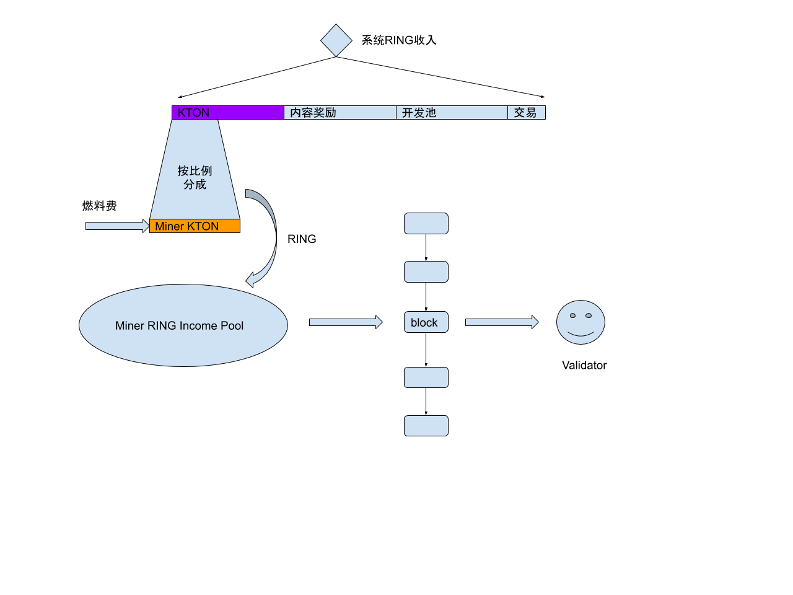

- 功能描述: 达尔文网络的燃料费模型
- 开始时间: 2019-04-28
- RFC PR: None
- Github Issue: None

# 概要
[summary]: #summary

达尔文网络的所有手续费总称燃料费，包括交易费用，合约执行费用，网络带宽费用，存储费用等等。EOS和波场引入的一些带宽和存储，仍然会带来一些认知门槛，所以倾向于不区分带宽和内存，都以燃料费代称。

燃料费等于燃料gas的数量乘以单位gas的价格gas price。gas price以氪石定价，因此达尔文网络将使用RING作为燃料费。

# 动机和目的
[motivation]: #motivation

达尔文网络需要一个合理的燃料费模型来实现两个目的：

- 矿工或者验证人足够的激励为系统工作来保持系统运转
- 用户需要有足够低的门槛，可以让新手不需要付费即可发起网络交易。
- 合约开发者也可以帮助用户支付燃料费。(参考波场的设计和实现)

# Guide-level explanation
[guide-level-explanation]: #guide-level-explanation

KTON可以使用获得系统的收入分成，在第一个版本的以太坊大陆和波场大陆中，氪石的分成通过通道代理实现了几乎实时的分成，但是在后续的版本这个特性将会稍作改变。当氪石相关功能迁移到达尔文网络中时，氪石获得的RING分成将会先在系统中锁定一个星期，一个星期到期后才可以提取到账户中用于转账等功能。

默认情况下，当用户发起一笔交易时，需要支付相应的RING作为燃料费，但是系统会优先从该账户的氪石锁定RING中扣去需要的燃料费，如果不够，再从账户的RING余额中扣除。

通过支持这个功能，我们将可以通过让新用户获得一定数量免费氪石的方式，定期获得燃料费，用于在进化星球达尔文网络和大陆(游戏)应用链中进行交易。

通过开发Faucet服务，可以支持免费发放燃料氪石(锁定)，帮助用户降低门槛。新玩家通过prove of person(POP)获得系统faucet免费获得的氪石作为燃料，可以通过设立基金会一次性抵押一些RING生成氪石用于发放。随着时间推移，氪石的通胀会将早期Faucet免费发放氪石的成本拉低。

简化的用户案例可以是，例如用户手机号注册后就有少量氪石。

关于用户持续获得氪石的问题，一方面可以引导付费后到银行换得氪石，另一方面可以持续利用活跃时间证明到faucet换取氪石。

# Reference-level explanation
[reference-level-explanation]: #reference-level-explanation

[WIP]

# 缺点
[drawbacks]: #drawbacks

[WIP]

# 理由
[rationale-and-alternatives]: #rationale-and-alternatives

- 出于用户认证门槛的考虑，不区分网络和带宽
- 在以太坊gas模型的基础上，借助于系统收入分成，锁定分成可以用于支付燃料费等业务应用，获得了类似抵押获得燃料费的同等效果。
- 保留gas price，让费用市场得以发挥作用和保留

# 现有技术
[prior-art]: #prior-art

在以太坊黄皮书以及Parity Substrate中已经有了一些经典设计和实现参考：

- [以太坊黄皮书Section 5 and Appendix G](https://ethereum.github.io/yellowpaper/paper.pdf)
- [Gas Model of Substrate Contract SRML](https://github.com/paritytech/substrate/blob/master/srml/contracts/src/gas.rs)

# 问题
[unresolved-questions]: #unresolved-questions

- 矿工和验证人是否得到足够强的激励来工作。(于此相关的一个问题是，目前由于RING设置了硬顶而无法通过通胀的方式给到矿工足够激励，需要从经济层面综合考虑一下)
- EOS和波场将燃料费分成了带宽和网络，感觉是为了更加精确的让市场调节资源，但是却极大的增加了用户的认知门槛，所以在达尔文的网络模型中没有使用这个方式。EOS和波场采取这个方式是否还有其他原因。

# 未来的可能性
[future-possibilities]: #future-possibilities

## 费用市场设计

基本的费用市场实现可以参考以太坊目前的设计，当时最近也有一些关于费用市场的最新研究，可以解决目前设计的一些重要缺陷，帮助最大化矿工收入和用户体验，达尔文网络将会在设计最终定型前引入这部分的研究成果。具体的内容可以参考[2][3]。

最终达尔文设计时，出去用户体验和需求方面的考虑，还可以考虑再简化一下，以降低gas price的认知门槛。当网络不拥堵时，问题不大，也就是一般的gas price也会打包，所以不会影响新用户进来，网络拥堵资源受限时，可以提高gas price，作为应用链可以在保证用户体验情况下提供推荐gas price。

## 基于氪石的燃料费模型

原来考虑过一种基于KTON的通胀燃料费模型，但是因为模型太复杂而遭到丢弃，可以作为参考。

每个区块里面收集的燃料费用将会进入一个矿工氪石池，这个矿工氪石池将会按持有氪石的比例获得来自系统的RING分成(目前氪石分成的比例为系统收入的30%)。矿工氪石池的RING收入将会用于支付Validator的区块奖励，每天的区块的总奖励可以按照当前池子里剩余RING的1/28发放，每个区块的奖励可以相应算得。

假设矿工氪石池的初始RING余额为 S, 后续每天的平均收入为 M，则第N天中池子的余额为：

                    

也就是

   

因此每天的RING区块奖励将趋近于矿工氪石池每天的平均收入M。

#### 通过Faucet免费发放燃料氪石(锁定)，帮助用户降低门槛

新玩家通过prove of person(POP)获得系统faucet免费获得的氪石作为燃料，可以通过设立基金会一次性抵押一些RING生成氪石用于发放。随着时间推移，氪石的通胀会将早期Faucet免费发放氪石的成本拉低，矿工的收入来自系统收入的一部分，收入多报酬多也比较合理。

简化的用户案例可以是，例如用户手机号注册后就有少量氪石。

关于用户持续获得氪石的问题，一方面可以引导付费后到银行换得氪石，另一方面可以持续利用活跃时间证明到faucet换取氪石。

# 参考

- [1] https://github.com/EOSIO/Documentation/blob/master/TechnicalWhitePaper.md
- [2] https://arxiv.org/abs/1709.08881
- [3] https://ethresear.ch/t/draft-position-paper-on-resource-pricing/2838
