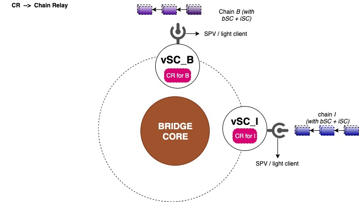
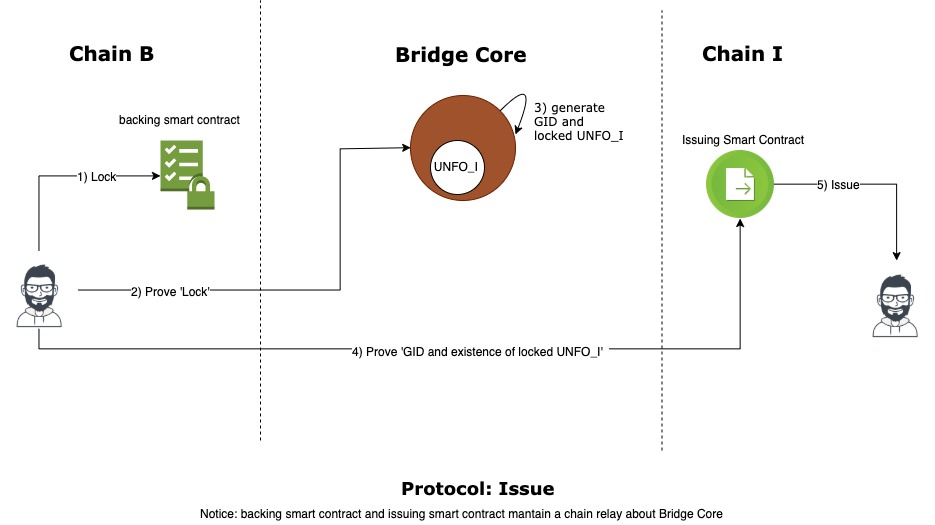
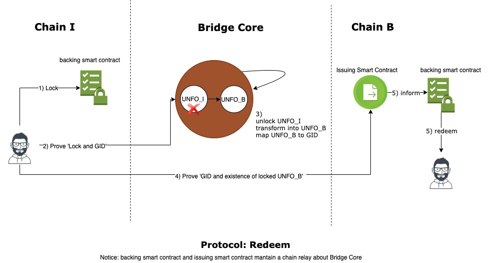
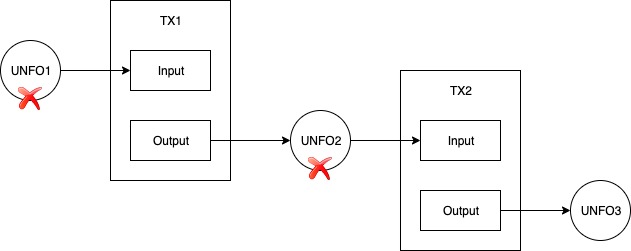
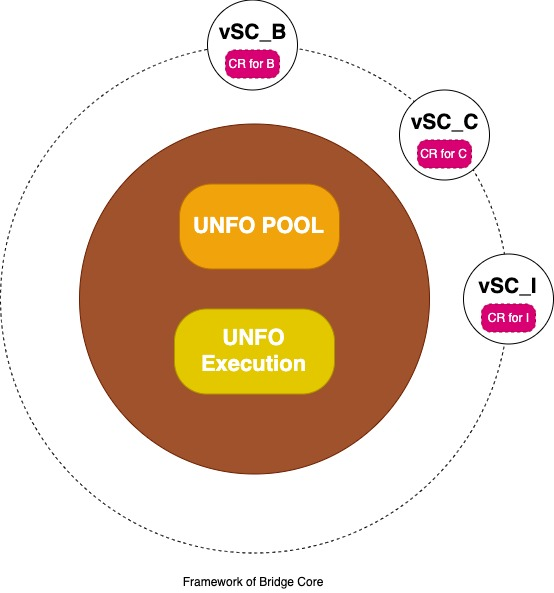

# Cross-chain Bridge Protocol			

###  v 0.1.0


## 0. 概述

对于不同区块链上的token交换，目前虽然中心化交易所可以帮助执行，但是这样的服务需要高度的信任，且易发生主动作恶、单点故障等问题。随着Cosmos、Polkadot这样一批优秀的跨链项目的落地，架构在跨链基础设施之上的去中心化token流通协议/方案也成为重要的研究内容。

在已有的方案中，atomic cross-chain swaps (ACCS) 是最早提出的可行性方案，但由于其跨链效率低、成本高，实际使用场景并不多。随后，XClaim (Cross Claim) 针对 ACCS 的缺点，提出了通用的、高效低成本的跨链框架，使用了Cryptocurrency-Bakced Assets (CBAs). 

XClaim 虽然某种程度上解决了 ACCS 的缺点，但是也存在其自身的局限性：只针对Fungible Token有效，并且。目前针对NFT的跨链流通还没有通用框架。本文提出了基于XClaim的适用NFT跨链的扩展协议（以双链互跨为例），并且在多链互跨的情况下，提出了更低成本、功能根据扩展性的跨链协议。

**关键词**：Blockchain, NFT, cross chain, multi-chain


## I. 背景

### A. 研究历史

比特币[1]的出现，允许每个人只要拥有私钥，就可以不依赖任何信任地操作自己的资产。整个比特币系统，由一系列记录着自己前序区块hash的区块构成，共同维护着同一份去中心化的全球“账本”。

比特币的出现之后，紧接着的就是区块链的飞速发展，出现了支持智能合约的公链——以太坊[2]，PoS的公链——EOS[3]等。这些公链的爆发，带来了整个token交易市场的繁荣。

主流的token交易/交换方式仍然是中心化交易所，用户的token由中心化交易所代为管理。信任和维护成本很高，并且还需要面临源源不断的黑客攻击的威胁。

为了克服中心化交易所的弊端，去中心化交易所 (DEX) 开始涌现。绝大部分去中心化交易所只支持在一条链上进行链内的token交易/转换，比如以太坊上的ERC20[4], ERC721 token[5]. 这一定程度上实现了去中心化，降低了信任成本（从相信机构变成了相信代码），但是使用场景十分有限，并且还要受限于公链的tps和交易费用。

当然也有一部分的去中心化交易所实现了ACCS，允许token跨链交换。它们使用了hashed timelock contracts (HTLCs)[6].  HTLCs的优点同它的缺点一样，都很明显。HTLCs可以在不需要信任的情况下实现跨链token的原子交换，这既实现了去中心化，又拓展了单条链上的DEX的功能。它的缺点就是成本太高，并且限制条件很多：(i) 所有参与方都必须保持全过程在线  (ii) 对粉尘交易失效  (iii) 通常锁定时间较长。这样的token跨链交换既昂贵又低效。在实际使用中，HTLCs的使用范例也非常少。

为了实现去信任的、低成本的、高效率的token跨链操作，XClaim团队提出了cross claim方案，基于CBA。并且在XClaim的论文中详述了XClaim是如何完成以下四种操作的：Issue, Transfer, Swap and Redeem.

 XClaim系统中保证经济安全的角色被称为 $vault$,  如果任何人想要把chain $B$ 上的原生token $b$ 跨到 chain $I$ 变成 $i(b)$ ，那么就需要 $vault$ 在chain $I$ 上超额抵押 $i$ 。 在以上四种操作中，如果 $vault$ 存在恶意行为，则罚掉 $vault$ 抵押的 $i$ ，用于补偿跨链发起者。其他细节详见XClaim的论文[7]。

至此，对于Fungible token的跨链，已经得到一个可靠的、可实现的方案。

### B. 尚未解决的问题

XClaim方案中有着一个基本假设，即跨链锁定的chain $B$ 的原生token $b$ 的总价值， 与在 $I$ 上发行出的 $i(b)$ 的总价值相等，在XClaim中被称为*symmetric*, 即 $ |b| = |i(b)|$。这样的假设是的XClaim在NFT的跨链中存在着天然的困境：

- NFT的不可替代性。正因为NFT具有可识别性、不可替代性等特点，使得 $vault$ 在 chain $I$ 上抵押chain $B$ 上的 NFT $nft_b$ 成了一件不可能的事情。
- NFT的价值难以评估。在XClaim中，判断 $vault$ 的抵押是否足额/超额，是通过Oracle $O$ 实现的。这也存在一个潜在的假设：token $b$ 和 token $i$ 可以被正确地评估价值。基于目前繁荣的中心化和去中心化交易所，在提供了良好的流动性的情况下，是可以基本满足该潜在假设的。但是NFT交易所市场尚未成熟，即使中心化交易所也无法比较真实地反应市场对NFT的价格判断。NFT如何定价本身就是一个难题。
- NFT定价不具有连续性和可预测性。即使某个NFT在市场上有了一次成交记录，即有了一个价格，因为NFT被售出的频次远低于FT，即使在市场流动性非常好的情况下，该NFT下一次的成交价格既不连续，也不可预测。

### C. Solution Description

在本文中介绍了两种NFT的跨链方案：

- 基于XClaim的NFT扩展
- 基于Multi chain relays


## II. XClaim-Based NFT cross-chain protocol

### A. 区块链模型假设

> 为了兼容 XClaim，这里对chain $B$ 和 chain $I$ 的假设和 XClaim一样，并不做更多的假设限制。

基本假设：

-  *backing blockchain*，只有基本的账本功能的区块链，对于NFT跨链，唯一增加的假设就是 *chain $B$* 原生token就支持NFT；

- *Issuing blockchain* , 支持图灵完备的智能合约的区块链；

在这里，我们构造出一个跨链场景：

Alice 在 *chain $B$* 上拥有 $nft_b^n$,  Dave在chain $I$ 上有足够的 $i$,  

1. Alice想在chain $I$ 上发行 $nft_b$ 对应的新NFT，即 $nft_i^{n'}$
2. Alice在拥有$nft_i^{n'}$ 之后，又想把它在chain $I$  上转移给 Bob
3. 或者在某个稍晚的时刻，Bob想从chain $I$ 上把资产赎回到 chain $B$ ，再次获得 $nft_b^n$ 

为了实现以上场景，XClaim-based NFT cross-chain protocol需要实现三种协议：*Issue, Trasnfer, Redeem*. 为了简化模型，我们在此处省略手续费相关部分的细节。


### B. 研究基础

如果以XClaim方案作为跨链的基本方案，那么在这个基础上，只需要解决NFT的定价问题，就可以解决系统的经济安全。

对于NFT的定价问题，目前中心化和去中心化交易所给出的解决方案就是交给市场。根据dapp数据统计网站显示，排名第一的NFT交易所Opensea[8]一天的日活用户仅为42，日交易笔数73. 即使也采用和XClaim相同的喂价方案Oracle, 在这样的市场面前，得到的价格也很难具有代表性。

并且，鉴于NFT的不可替代性，市场定价的方法也存在天然的悖论。即买卖成功才可以定价；但是买卖成功同时也意味着owner的转移。

目前对于NFT的定价问题，还没有成型的方案。


#### B-I. 什么是Harberger Taxes

市场和私有财产是两个通常被放在一起谈论的话题，在现在社会很难想象，如果只单独谈论其中的一点却不提及另一点。然而在十九世纪，很多欧洲的经济学者也是自由论者和平等主张者，那时拥抱市场同时对私有财产持怀疑态度是很正常的事情。

由此，实现一个包含市场但是却没有所有权的系统是完全可行的：在每年的结束，收集物品的价格，在第二年的一开始，物品属于出价更高的人。这样的系统虽然在现实中不可行，但是它有一个显著的优点：实现配置效率。每年，每件物品都属于可以从中获取最大价值的人（因此才愿意出更高的价格）。

Eric Posner 和 Glen Weyl, 《radical market》的作者提出了一个方案Harberger Taxes[9]：1. 所有人都为自己的财产评估一个价格  2. 所有人按评估价的百分比，例如2%进行交税  3. 其他人可以以不小于评估价的价格，随时买走自己的财产。这就强制所有人都必须公平客观地评估物品的价格，评估地过高，自己就要多缴税；评估地过低，其他人就可以获得消费者剩余。


#### B-II. Harberger Taxes在跨链中的应用

我们提议将Harberger Taxes应用于NFT的定价上。不同于将定价问题交给时间和市场，我们提议将定价问题交给跨链发起者自己。

因跨链并不需要涉及到NFT的交易，所以我们只应用Harberger Taxes的卖方估价并交税的部分，并不应用强制交易的部分。

大概的思路为，由跨链发起者为其需要跨链的在chain $B$ 上的NFT $nft_b$ 声明一个价格 $p$ ，并按照一定比例的价格支付跨链手续费；对应地，$vault$ 需要按价格在chain $I$ 上提供等值/超值于$p$ 的抵押 $i$，如果跨链操作正确完成，则跨链手续费将被支付给对应的 $vault$ ；如果存在恶意行为导致跨链失败并且$nft_b$ 的归属者发生错误转移，则抵押的 $i$ 将用于补偿跨链发起者的损失。


### C. 组件定义

这里我们将部分遵从XClaim的声明方式，以保持延续性：

- *Issuing blockchain*, the blockchain $I$, 跨链后的新NFT的发行链
- *backing blockchain*, the blockchain $B$, 跨链前NFT所在的链
- *NFT identifier*, $nft_b^{n}$， 表示在chain $B$ 上的原生的、标识为 $n$ 的NFT，出现在章节II中
- *NFT identifier*, $nft_i^{n'}$， 表示跨链后在chain $I$ 上新增发的、 标识为 $n$ 的NFT，出现在章节II中
- *native token on chain $I$*:  $i$
- 抵押token，$i\_col$ , 表示在chain $I$ 上抵押的token

系统参与方：

- **Requester** :  在chain $B$ 上锁定 $nft_b^n$  并且希望在 $I$ 上获得新发行的$nft_i^{n'}$ ；
- **Sender**： 在  $I$ 上拥有$nft_i^{n'}$ 并且可以转移它的所有权给其他人；
- **Receiver**： 在 $I$ 接受并且获取 $nft_i^{n'}$ 的所有权的人；
- **Redeemer**： 在 $I$ 上销毁 $nft_i^{n'}$ ，而后在 $B$ 上释放 $nft_b^n$；
- **vault**： 不需要信任的第三方，保证 *Issue* 和 *Redeem* 时整个系统的经济安全；
- **Issuing Smart Contract (iSC)**：在 $I$ 上完全公开的、负责管理$vault$ 名单并负责发行NFT资产$nft_i$ 的智能合约
- **backing Smart Contract(bSC)**: 在 $B$ 上完全公开的、负责管理冻结后的NFT资产 $nft_b$ 的智能合约 （出现在章节III）

其中，*Requester, redeemer, vault* 必须在 *chain $I$ 和 chain $B$* 上都有对应的公私钥；*Sender, Receiver*只需要持有在 $I$ 上的公私钥；*iSC* 是在 $I$ 上完全公开的、可审计的智能合约；*bSC*是在 $B$ 上完全公开的、可审计的智能合约。

### D. 初步实现方案

#### Protocol: Issue

> Alice (requester) 把  $nft_b^n$ 在 $B$ 上锁定在 $vault$，为了在 $I$ 上创造 $nft_i^{n'}$.

(i) ***准备***。Alice 预先声明一个价格 $p$,  确认 iSC 有效并且在 iSC 中寻找有足额/超额抵押 ($i\_col$) 的 $vault$.

(ii) ***锁定***。Alice 把 $nft_b^n$ 转移给 $vault$，同时声明自己在 $I$ 上的地址；并且支付跨链手续费；

(iii) ***发行***。$vault$ 向iSC发送签名消息: 同意向Alice在 $I$ 上的地址发行新资产， iSC 在确认 $vault$ 的签名后，在Alice的地址上发行 $nft_i^{n'}$

#### Protocol: Transfer

> Alice (sender) 在 chain $I$ 发送 $nft_i^{n'}$ 给 Bob (receiver) 

(i) ***转移***。Alice在 $I$ 上把 $nft_i^{n'}$ 在 iSC中，把所有权转移给 Bob，参考ERC721.

(ii) ***见证***。当 $nft_i^{n'}$ 在 iSC 中的所有权发生了转移时，相应的 $vault$ 应当可以见证觉察。此时，当Alice再想把 $nft_i^{n'}$ 赎回时，$vault$ 在 iSC 中发现 $nft_i^{n'}$ 的所有权已经转移给Bob之后，应当禁止该交易。

需要补充的是，在系列操作的过程中，$nft_i^{n'}$ 的价格可能发生波动，该NFT的当前所有人可随时为其声明新的价格，相应地，$vault$ 需要满足质押。

#### Protocol: Redeem

> Bob想把 $nft_i^{n'}$ 从 $I$ 中赎回到 $B$ 中时，Bob需要把 $nft_i^{n'}$ 锁定在 iSC 里，这样 $vault$ 在 $B$ 上就会把 $nft_b^n$ 释放给 Bob. 然后在 $I$ 中销毁$nft_i^{n'}$。

(i) ***准备***。Bob需要现在 $B$ 上创建地址，持有对应私钥。

(ii) ***锁定***。 Bob在 $I$ 上把 $nft_i^{n'}$ 锁定在 iSC 中，发起赎回请求，请求中应包含 Bob 在 $B$ 上的地址。并且，$vault$ 应当对这一过程保持觉察。

(iii) ***释放***。$vault$ 可以在 iSC 中验证锁定操作和赎回请求， 之后在 $B$ 上将对应的 $nft_b^n$ 发送给 Bob的地址。

(iv) ***销毁***。 $vault$ 提交 在 $B$ 上的释放证明 (proof) 给 iSC，iSC在验证 proof 之后自动销毁 $nft_i^{n'}$ 并且允许 $vault$ 解冻对应的 $i\_col$


​																						  (图片来自XClaim，有待修改)

### C. Design Roadmap

在之前的示例说明中，都默认了单 $vault$ 模式。 XClaim本身对于这种模式就有了扩展的、更加去中心化的解决方案，即引入 *multi-vault*，允许任何人抵押 $i\_col$ 成为 $vault$，从而最大程度减轻单点故障对整个系统带来的影响。因此XClaim-based NFT跨链方案，天然支持这种扩展。

然而，由于NFT的不可替代性，导致NFT的估价不具备连续性和可预测性，价格上有很大概率存在剧烈波动，从而影响系统的安全性。为了尽量减低NFT价格波动对系统安全性的冲击，我们将在III中引入全新的解决方案，通过基于全新且合理的区块链假设，不依赖 $vault$ ，即在 *non-vault* 的情况下，实现跨链安全。

1. 通过继承XClaim的扩展方案，首先，尽可能减低对$vault$ 的信任依赖，甚至实现0信任依赖，来实现整个系统的健壮性。在这里，我们引入 $chain\ relay$ (章节III) 来为 iSC 提供 chain $B$ 的上的区块和交易证明，对任何人公开可查。
2. 在整个跨链过程中，$vault$ 要保持参与，为了防止单个 $vault$ 可能发生的单点故障，这里我们同样采取和XClaim相同的做法，开放 $vault$ 的注册，允许任何愿意抵押 $i\_col$ 的人或者机构都可以成为 $vault$.
3. 前述，即使NFT价格可以被正确评估，但是由于NFT价格的不连续性和波动幅度大的特点，使得 $vault$ 的抵押也可能存在较大幅度的波动。因此，在章节III中，我们引入了没有 $vault$ 的跨链解决方案。这对chain $B$ 会有更高的假设限制，技术维护上的成本也会更高一些。但是相比于XClaim沉淀了大量的抵押资金，然而在经济上目前还没有可持续性的激励方案，我们认为技术维护上多出的成本，远远小于抵押资金的时间成本。值得尝试。


## III. *Non-vault* NFT multi-chain operations protocol

本章节将展示NFT multi-chain operations protocol的设计思路和过程实现。在章节II中，XClaimed-based跨链方案已经可以保证了在大部分场合下的NFT的跨链安全操作，但是依然无法保证当NFT价格产生剧烈波动时，整个系统的鲁棒性和可持续性。

所以我们引入了完全无 $vault$ 的跨链方案，通过引入技术安全性：

- ***bSC + iSC***: 在章节II中，对chain $B$ 没有任何额外的要求，导致在 chain $B$ 上的安全只能由在 chain $I$ 上抵押 $i\_col$ 的 $vault$ 来提供。在III-A中将详述对 chain $B$ 引入的新的假设约束。一旦 chain $B$ 上的资产安全可以非互操作性地实现，将降低对 $vault$ 的依赖。

- ***multi chain relay***: *chain relay* 可以提供区块链的区块和交易证明，它在XClaim扩展方案中，也被应用来减低对 $vault$ 的信任依赖。在章节III-B中，将介绍 *multi chain relay* 如何在保证安全的基础上，进一步地减少对 $vault$ 的依赖。

### A. 区块链模型假设

在目前已经上线的区块链项目中，几乎没有NFT作为链的原生资产的，所有的NFT几乎都是在智能合约内实现的。因此，对原生资产所在的chain $B$, 可以引入全新且合理的假设：

- *backing blockchain* 和 *Issuing blockchain*:  都支持图灵完备的智能合约

这样我们就可以通过在 $B$ 和 $I$ 上放置独立的智能合约 bSC 和 iSC 来提供更强的技术约束，保证跨链的安全性。

### B. Chain Relay

#### B-I. 什么是 *chain relay*

XClaim 给出了对 *chain relay* [7]的定义：

> Chain relays: Cross-Chain State Verification. It is capable of interpreting the statte of the backing blockchain B and provide functionality comparable to an SPV or light client[10].

因此，*chain relay* 可以被认为是由包含root of merkle tree的区块头组成。它为 iSC 提供了两种功能： *交易存在证明* 以及 *共识证明*。

- ***交易存在证明***： *chain relay* 存储着区块链的每一个区块头，以及区块头里的root of merkle tree. 在提供merkle tree路径的情况下，这已经足够可以证明一笔交易是否存在于这条链的某个区块中。
- ***共识证明***： 以比特币为例，因为每个节点通常不能即时看到全网的情况，因此经常会发生产生孤块，又在重组中被丢弃的情况。为了避免这种情况带来的攻击/漏洞，*chain relay* 必须要验证给定的区块头是否为完整区块链的一部分，例如被大部分节点认可。对于共识为Proof-of-Work的区块链，*chain relay* 必须：(i) 知道挖矿难度调整策略  (ii) 验证收到的区块头是否在具有最多累计工作量证明的链上。 对于共识为Proof-of-Stake的区块链，*chain relay* 必须：(i) 知道协议要求/staking的阶段，例如epoch  (ii) 验证区块头中验证人签名数量是否满足区块的阈值要求。 


​																						（图片来自XClaim，待更新 ）

#### B-II.  *chain relay* 如何去信任

这里以章节II中的 *Protocol Issue* 为例，当 *requester* 把 $nft_b^n$ 锁定在 $vault$ 时，会产生一笔交易: $lock(vault_address, lock_amount) -> T_l$ ，随后 *requester* 会向 *chain relay* 提交这笔交易$T_l$ ，之后 *chain relay* 会检验 $T_l$ 确实是存在于给定区块的交易中，这个区块也存在于最长链中，那么就证明token已经被安全地锁定了。如果验证通过，会原子地触发 iSC 中的资产发行操作。


#### B-III. *multi chain relay* 架构

在两条公链中跨链转移token，s需要在chain $I$ 维护 *chain relay* 的成本是很高的，例如以太坊上每笔交易需要gas。如果把两条公链之间的跨链行为扩展到任意 $n$ 公链的话，那么每条链上都需要单独维护 $n-1$ 个 iSC，成本将成指数级增长。为了降低系统的维护成本，考虑在基于substrate的平行链上实现跨链的核心功能。

那么整个系统的架构如下：



图中 **Bridge Core** 即为基于Substrate 的 parachain；**vSC** 为 **Bridge Core** 的对应链的资产的发行模块。和以前的跨链方案不同的是，在上图的架构中，所有链的token需要先跨入**Bridge Core**, 而后在 **Bridge Core** 内部转换到目的公链对应的iSC 中，最后再在对应公链上发行对应的资产，整个跨链操作即完成。


### C. 组件定义

- *Issuing Smart Contract*,  $iSC_N$:  表示在 chain *N* 上的资产发行合约；
- *Backing Smart Contract*,  $bSC_N$ : 表示在 chain $N$ 上的资产锁定合约；
- *Verifying Smart Contract*,  $vSC_N$ : 表示在Bridge Core上负责验证 chain *N* 上交易的资产发行合约/模块；
- *NFT identifier*,  $nft_B^{x,n}$,  表示在chain $B$ 上，在合约 $x$ 中标识为 $n$ 的NFT
  - *NFT identifier in Bridge Core*, $nft_{BC}^{B, n''}$ ，表示在Bridge Core，并且和 chain $B$ 上的 $nft_B^{x,n}$ 互为镜像
- *NFT identifier*,  $nft_I^{x',n'}$,  表示跨链后在chain $I$ 上新增发的、在合约 $x'$ 中标识为 $n'$ 的NFT
- *NFT in Bridge Core*: $nft_{BC}^{X,n'}$ , 表示在 *bridge Core* 中，在 $iSC_{BC}^X$ 里、标识为n'的NFT资产；
- *Locking Transaction* ,  $T_{B}^{lock}$,  在 chain *B* 上把 NFT 锁定在 $bSC_B$ 中的交易
- *Redeem Transaction* ,  $T_I^{redeem}$， 在chain *I* 上把 NFT 锁定在 $bSC_I$ 中的交易
- *Extrinsic Issue*,  $EX_{issue}$ , Bridge Core上的 issue 的交易 
- *Extrinsic redeem*,  $EX_{redeem}$ , Bridge Core上的 redeem 的交易 
- *Global NFT identifier*,  $GID$

参与方：

- *witness*,  维护 *chain relays* 的参与方；

其他定义同章节II-C

### D. 初步实现方案

场景同章节II中的描述。依然需要实现三种 protocol：*Issue, Transfer, Redeem*. 同样为了简化模型，这里将不会讨论手续费相关细节。

#### Protocol: Issue

(i) ***锁定***。*requester* 将 chain $B$上的NFT资产 $nft_B^{n,x}$ 锁定在 $bSC_B$ 中，同时声明目的地公链 chain *I* 以及自己在chain $I$ 上的地址；这一步将产生交易$T_B^{lock}$

(ii) ***Bridge Core上发行***。 *requester*  将锁定交易 $T_B^{lock}$ 提交至 Bridge Core, 对应的chain relay验证通过后，即 触发 $vSC_B$ , 在 $vSC_B$ 中：

- 产生新的$GID$ 并且触发相应目的地公链的 $vSC_I$ ,  
- 在 $vSC_I$ 中记录 $GID$ 和 $nft_B^{x,n}$ 的对应关系，
- 并触发$vSC_I$ 

在 $vSC_I$ 中：

-  发行 $nft_{BC}^{I,n''}$， 并且 $nft_{BC}^{I,n''}$: 的状态为 *lock*。 $issue\_ex(nft\_id\_on\_B,\ GID,\ address\_on\_I) \rightarrow EX_{issue}$

(iii) ***发行***。*requester* 将 $EX_{issue}$ 提交至 chain $I$ , 经过chain $I$ 上的chain relay 验证通过后，即会在$iSC_I$ 中增发新的NFT: $nft_I^{x', n'}$， 记录 $GID$ 和 $nft_I^{x', n'}$的关系， 并将所有权交给 *requester* 在chain *I* 上的地址

过程如下：



#### Protocol: Transfer

(i) ***转移***。*sender* 在 $I$ 上把 $nft_i^{x',n'}$ 在  $iSC_I$ 中，把所有权转移给 *receiver*，参考ERC721.

(ii) ***见证***。当 $nft_i^{x',n'}$ 在  $iSC_I$ 中的所有权发生了转移时，$iSC_I$ 和 $bSC_I$ 都应当觉察。此时，当 *sender* 再想把 $nft_i^{x',n'}$ 赎回时需要先将其锁定在 $bSC_I$ 中，此时 $bSC_I$ 将不会允许该操作成功。

#### Protocol: Redeem

(i) ***锁定***。 *redeemer* 将 chain $I$ 上的NFT资产 $nft_I^{x', n'}$ 锁定在 $bSC_I$ 后 (如果有对应的GID，锁定时需声明 $GID$)，同时声明目的地公链chain $B$ 以及自己在 chain $B$ 上的地址；$bSC_I$ 会原子地 在 $iSC_I$ 中确认 $GUID$ 的正确性。这一步将产生交易$T_I^{redeem}$。$redeem\_tx(nft\_id\_on\_I,\ GID,\ address\_on\_B) \rightarrow T_I^{redeem}$ 

(ii) ***Bridge Core上解锁***。 *redeemer* 将 $T_I^{redeem}$ 提交至 $vSC_I$ 并在chain relay中验证通过后，会在 $vSC_I$ 中：

- 记录 $GUID$ 和 $nft_I^{x', n'}$ 的对应关系，
- 将$nft_BC_{I,n''}$ 的状态更改为 *unlock*，
- 判断目的地公链并触发相应的 $vSC_B$ ,

在 $vSC_B$ 中, 

- 将 $nft_{BC}^{I,n''}$ 变为 $nft_{BC}^{B, n''}$ ，
- 并且记录 $nft_{BC}^{B, n''}$  和 $GID$ 的对应关系，
- 并且将 $nft_{BC}^{B, n''}$ 的状态更改为 $lock$

以上过程均在一次Extrinsic内触发，将会产生一笔Extrinsic id，记录为 $EX_{redeem}$

(iii) ***解锁***。 *redeemer* 将 $EX_{redeem}$ 提交给 chain $B$ ， 经过$iSC_B$ 验证通过后，在 $iSC_B$ 中会记录 $GUID$ 和 $nft_B^{x,n}$ 的对应关系， 同时会原子地触发 $bSC_B$ 中的方法，将 $nft_B^{x,n}$ 还给指定的地址。 

过程如下：




### E. NFT 转换在 Bridge Core内的实现

在 Bridge Core 内的 中间状态的NFT在上文中被标记为 $nft_{BC}^{X,n''}$ ，表示在对应 chain $X$ 中有一个即将被发行/已锁定的 NFT. 

在 Bridge Core 内这些 中间态的NFT被标记为 UNFO (Unspent Non-Fungible Output). 该想法源于UTXO，当一个UNFO被销毁时，意味着同时会产生一个新的UNFO.


#### E-I. UNFO 结构

UNFO的结构：

```rust
struct UNFO {
  pub local_id, // chain_id + smart_cotnract_id + token_id
  pub global_id,
  pub lock_script, // e.g. to check if it is locked or unlocked
}
```

当一个UNFO产生时，一定要满足：

- 提供 *backing blockchain* 的 对应NFT 的锁定记录；
- 另一个UNFO被销毁
  -  条件：销毁和产生的UNFO的GID必须相同




#### E-II. Bridge Core 内部结构





### F. Open Concern: NFT Specific Design and Standards

NFT跨链操作的难点在于，不同的公链有着自己的NFT标准，甚至不同公链上的NFT的token id连长度都是不相等的，NFT在跨到不同公链时，必然会经历token id的转换。如何在跨链的过程中不丢失NFT的可识别性，是一个值得研究的命题。

[WIP](https://github.com/darwinia-network/rfcs/blob/master/RFC/zh_CN/0011-darwinia-cross-chain-nft-design-and-standards.md)


## 参考

[1] https://bitcoin.org/bitcoin.pdf

[2] https://github.com/ethereum/wiki/wiki/White-Paper

[3] https://github.com/EOSIO/Documentation/blob/master/TechnicalWhitePaper.md

[4] https://eips.ethereum.org/EIPS/eip-20

[5] https://eips.ethereum.org/EIPS/eip-721

[6] https://en.bitcoin.it/wiki/Hashed_Timelock_Contracts

[7] https://eprint.iacr.org/2018/643.pdf

[8] https://opensea.io/

[9] https://vitalik.ca/general/2018/04/20/radical_markets.html?source=post_page-----c2c99e866f87----------------------

[10] https://github.com/ethereum/wiki/wiki/Light-client-protocol

[11] https://elixir-europe.org/platforms/interoperability

[12] https://github.com/AlphaWallet/TokenScript

[13] https://github.com/darwinia-network/rfcs/blob/v0.1.0/zh_CN/0005-interstella-asset-encoding.md

[14] https://onlinelibrary.wiley.com/doi/pdf/10.1087/20120404

[15] https://wiki.polkadot.network/en/latest/polkadot/learn/spree/

[16] https://en.wikipedia.org/wiki/Unique_identifier

[17] https://en.wikipedia.org/wiki/Identifiers.org

[18] https://schema.org/

[19] https://medium.com/drep-family/cross-chains-a-bridge-connecting-reputation-value-in-silo-b65729cb9cd9

[20] https://github.com/paritytech/parity-bridge

[21] https://vitalik.ca/general/2018/04/20/radical_markets.html

[22] https://talk.darwinia.network/topics/99

